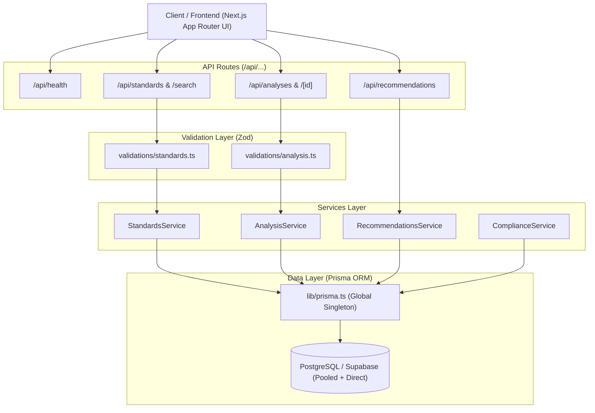

# IS-Guide AI (Indian Standards Intelligence)

AI-Powered Recommendation Engine for Identifying Applicable Indian Standards for Procurement Specifications.

IS-Guide AI is designed to assist public procurement officers, engineers, and tender authorities in identifying, verifying, and mapping applicable Indian Standards (BIS / Bureau of Indian Standards) for items and technical specifications in procurement documents and tenders.

---

## Current Status: Phase 1 — Backend & Database Foundation

> [!NOTE]
> **Phase Notice:**
> The current phase establishes the **Backend Architecture, Database Design (Prisma ORM + PostgreSQL / Supabase), Validation Pipelines (Zod), and RESTful API Endpoints**.
> 
> **AI / Semantic Recommendation Features are NOT yet implemented in this phase.**
> The next phase will introduce verified BIS standards data ingestion, document parsing, requirement extraction, embeddings, pgvector hybrid search, and explainable AI recommendations.

---

## System Architecture



---

## Technology Stack

* **Framework:** [Next.js](https://nextjs.org/) (App Router, Turbopack)
* **Language:** TypeScript
* **ORM:** [Prisma ORM](https://www.prisma.io/) (^6.4.1)
* **Database:** PostgreSQL (Compatible with [Supabase](https://supabase.com/))
* **Request Validation:** [Zod](https://zod.dev/) (^3.24.2)
* **Styling:** Vanilla CSS / Tailwind CSS (Glassmorphism & Claymorphism Government-Tech UI)
* **Deployment Target:** Vercel + Supabase

---

## Database Schema (Prisma Models)

The database schema is defined in `prisma/schema.prisma` and models the full lifecycle of standards compliance, procurement specifications, and recommendation tracking:

1. **`User`**: Authentication and user management.
2. **`ProcurementAnalysis`**: Analysis sessions, input payloads (`TEXT`, `PDF`, `DOCX`), and status workflow (`PENDING`, `PROCESSING`, `COMPLETED`, `FAILED`).
3. **`ProcurementDocument`**: Uploaded tender files and parsed text attachments.
4. **`ExtractedRequirement`**: Structured parameters extracted from tender specifications (e.g., categories `PRODUCT`, `APPLICATION`, `MATERIAL`, `DIMENSION`, `PERFORMANCE`, `SAFETY`, `ENVIRONMENT`, `TESTING`, `ELECTRICAL`, `CERTIFICATION`).
5. **`Standard`**: Verified Indian Standards registry (`standardNumber`, `title`, `shortTitle`, `category`, `scope`, `status`). Unique index on `standardNumber`.
6. **`StandardVersion`**: Historical editions, publication dates, and validity periods.
7. **`StandardAmendment`**: Gazette amendments and revision tracking.
8. **`StandardRelationship`**: Graph relationships between standards (`NORMATIVE_REFERENCE`, `TEST_METHOD`, `SAFETY`, `INSTALLATION`, `TERMINOLOGY`, `RELATED_PRODUCT`, `SUPERSEDES`, `AMENDS`, `RELATED_STANDARD`).
9. **`Recommendation`**: Recommended standards ranked per analysis session with confidence and relevance scores.
10. **`RecommendationEvidence`**: Explainability traces linking recommendations directly to tender requirements (`SPECIFICATION_MATCH`, `SCOPE_MATCH`, `TECHNICAL_MATCH`, `RELATIONSHIP`, `VERSION`, `OTHER`).
11. **`CertificationRequirement`**: Conformity assessment schemes (e.g., ISI Mark, CRS, Hallmarking).
12. **`AnalysisCertification`**: Identified certification obligations for procurement.
13. **`Report`**: Generated procurement compliance and specification reports.

---

## Environment Configuration

Copy `.env.example` to `.env.local` and add your database connection strings:

```bash
cp .env.example .env.local
```

### Required Variables:

* `DATABASE_URL`: Transaction-pooled connection string (e.g., Supabase port `6543` with `?pgbouncer=true&connection_limit=1`).
* `DIRECT_URL`: Direct session connection string for database migrations and schema pushes (e.g., Supabase port `5432`).

> [!WARNING]
> Never commit `.env.local` or expose database credentials, service-role keys, or API tokens.

---

## Installation & Setup

1. **Install Dependencies:**
   ```bash
   npm install
   ```

2. **Generate Prisma Client:**
   ```bash
   npm run db:generate
   ```

3. **Synchronize Database Schema with PostgreSQL / Supabase:**
   ```bash
   # For development pushing schema directly:
   npm run db:push

   # Or for migration-based workflows:
   npm run db:migrate
   ```

4. **Seed Database (Optional Demo Data):**
   ```bash
   npm run db:seed
   ```
   *Note: Real Indian Standards are NOT fabricated. Seed data only initializes neutral certification reference frameworks.*

5. **Start Development Server:**
   ```bash
   npm run dev
   ```
   Open [http://localhost:3000](http://localhost:3000) to view the application.

6. **Validate Types & Build:**
   ```bash
   npm run typecheck
   npm run build
   ```

---

## Available API Endpoints

| Method | Endpoint | Description |
| :--- | :--- | :--- |
| `GET` | `/api/health` | Healthcheck and service identity probe |
| `GET` | `/api/standards` | Paginated listing of Indian Standards (supports `page`, `limit`, `search`, `category`, `status`) |
| `GET` | `/api/standards/[id]` | Detail view with versions, amendments, and normative relationships |
| `GET` | `/api/standards/search` | Keyword search across standard number, title, and scope |
| `POST` | `/api/analyses` | Submit procurement specification for analysis (creates `PENDING` analysis) |
| `GET` | `/api/analyses` | Paginated listing of user analyses |
| `GET` | `/api/analyses/[id]` | Retrieve full analysis with documents, requirements, and recommendations |
| `GET` | `/api/analyses/[id]/recommendations` | Retrieve recommended standards for a specific analysis |
| `GET` | `/api/recommendations?analysisId=...` | Direct recommendations query endpoint |

---

## Example API Requests & Responses

### 1. Healthcheck
```bash
curl -X GET http://localhost:3000/api/health
```
```json
{
  "status": "ok",
  "service": "is-guide-ai-api",
  "timestamp": "2026-09-29T02:55:12.677Z"
}
```

### 2. Search Standards
```bash
curl -X GET "http://localhost:3000/api/standards/search?search=steel&limit=10"
```
```json
{
  "data": [],
  "pagination": {
    "page": 1,
    "limit": 10,
    "total": 0,
    "totalPages": 0
  }
}
```

### 3. Create Procurement Analysis
```bash
curl -X POST http://localhost:3000/api/analyses \
  -H "Content-Type: application/json" \
  -d '{
    "title": "Procurement of High Tensile Steel Reinforcement Bars",
    "inputType": "TEXT",
    "rawInput": "Supply of Thermo-Mechanically Treated (TMT) carbon steel bars grade Fe 500D for concrete reinforcement conforming to standard specifications.",
    "language": "en"
  }'
```
```json
{
  "analysis": {
    "id": "cm8... (or dev-analysis-...)",
    "title": "Procurement of High Tensile Steel Reinforcement Bars",
    "inputType": "TEXT",
    "rawInput": "Supply of Thermo-Mechanically Treated (TMT) carbon steel bars grade Fe 500D for concrete reinforcement conforming to standard specifications.",
    "language": "en",
    "status": "PENDING",
    "userId": null,
    "createdAt": "2026-09-29T02:55:15.000Z",
    "updatedAt": "2026-09-29T02:55:15.000Z",
    "documents": [],
    "requirements": []
  }
}
```

### 4. Validation Error Handling
```bash
curl -X POST http://localhost:3000/api/analyses \
  -H "Content-Type: application/json" \
  -d '{"title": "X"}'
```
```json
{
  "error": {
    "code": "VALIDATION_ERROR",
    "message": "Title must be at least 3 characters",
    "details": [
      {
        "field": "title",
        "message": "Title must be at least 3 characters"
      },
      {
        "field": "rawInput",
        "message": "Raw input content is required"
      }
    ]
  }
}
```

---

## Upcoming Phases

* **Phase 2:** Verified BIS Standards data ingestion pipeline & automated gazette amendment parser.
* **Phase 3:** Tender document parser (`PDF`, `DOCX`, scanned text OCR).
* **Phase 4:** Deep requirement extraction & parameter structuring.
* **Phase 5:** Text embeddings & pgvector hybrid semantic retrieval.
* **Phase 6:** Normative and allied standards graph traversal engine.
* **Phase 7:** Explainable AI recommendations & procurement gap analysis reports.
